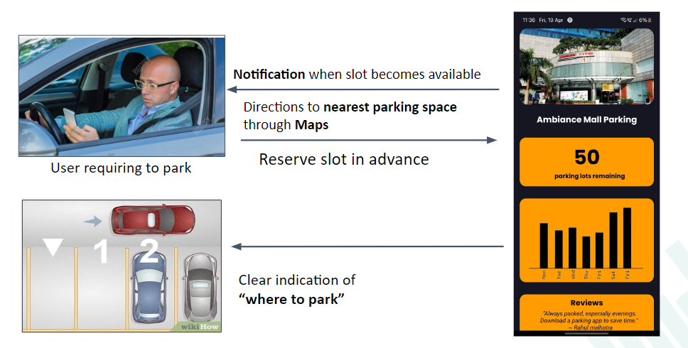
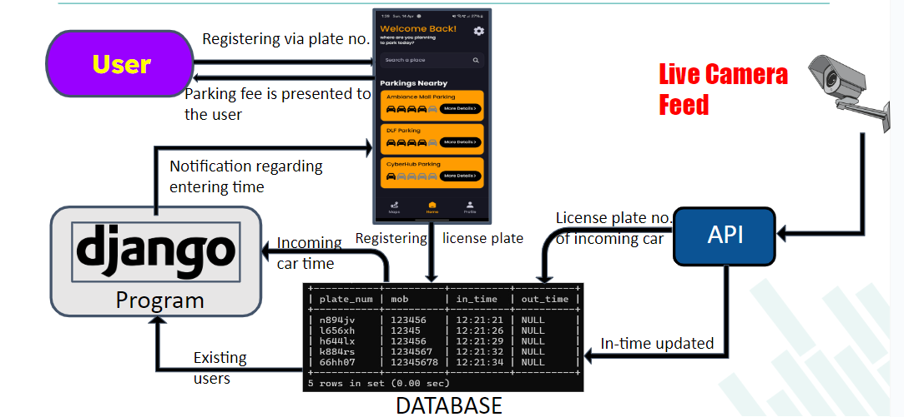

# Parking Optimization Solution

## Description
SpotSync is a complete parking solution designed to make parking easier and more efficient.

## Features
SpotSync has two main features:

1. **Empty Spot Counter**: This feature displays the number of available parking spots in any parking area through an app interface. All you need is an installed CCTV camera.

https://github.com/Sanchit-100/SpotSync/assets/141770981/239a781d-b734-48bb-9e88-4ac52c9c2c66

2. **Self Check-in and Check-out**: Say goodbye to parking tickets and booths. Just drive in and drive out. A camera installed at the entrance and exit updates your entry and exit times using your license plate numbers. The calculated fee is automatically deducted from your preferred account or wallet. You receive notifications throughout the process on your mobile app.

https://github.com/Sanchit-100/SpotSync/assets/141770981/2459d523-bcb0-45bc-b2ec-085dc50fef7e

## Architecture

